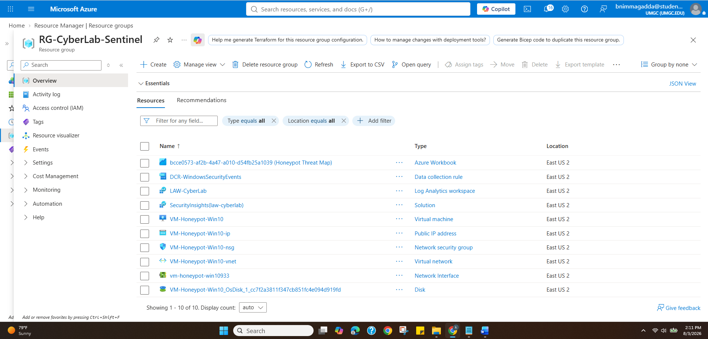
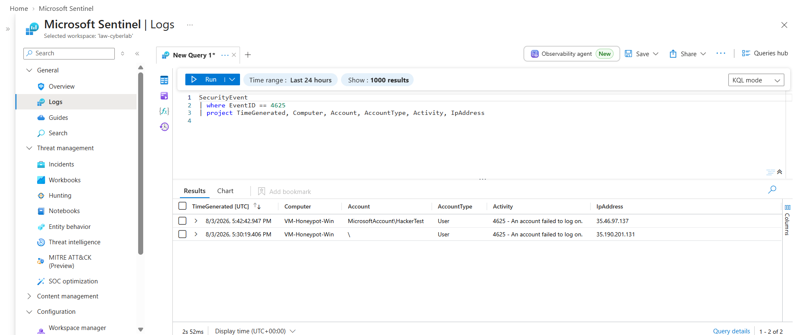
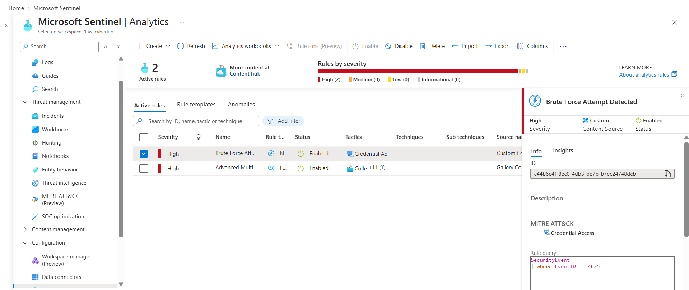
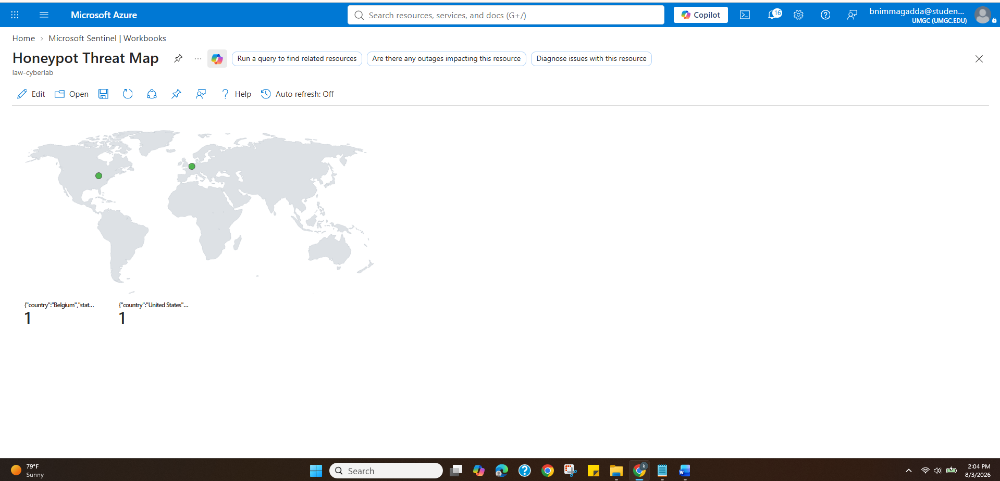

# Azure Sentinel Cloud SIEM & Live Threat Intelligence Honeypot
Cloud SIEM Honeypot Lab using Microsoft Azure, Microsoft Sentinel, Log Analytics, and KQL to ingest, detect, and map live brute-force attack telemetry.
## Project Overview

For this lab, I deployed a Windows 10 virtual machine and intentionally exposed Remote Desktop Protocol (RDP) port 3389 to the internet so that the system could function as a honeypot. The goal was to observe authentication attempts against an internet-facing system and then collect, analyze, detect, and visualize those events using Microsoft Sentinel.

I connected the Windows virtual machine to a Log Analytics Workspace using the Azure Monitor Agent (AMA) and a Data Collection Rule (DCR). After confirming that Windows security events were reaching the workspace, I used Kusto Query Language (KQL) to identify failed logon attempts. I then created a Microsoft Sentinel analytics rule to detect the activity and generate security incidents automatically.

Finally, I created a Sentinel Workbook that enriched the source IP addresses with geolocation information and displayed the observed authentication attempts on an interactive world map.

## Architecture

The project followed the following basic data flow:

**Internet → Azure Windows Honeypot → Azure Monitor Agent → Data Collection Rule → Log Analytics Workspace → Microsoft Sentinel → Analytics Rules / Incidents / Workbooks**

The Windows virtual machine generated security events whenever authentication activity occurred. These events were collected by the Azure Monitor Agent and forwarded according to the Data Collection Rule into the Log Analytics Workspace, where Microsoft Sentinel could analyze the data.

## 1. Azure Infrastructure and Log Collection

### Configuration

I created a dedicated Azure Resource Group named:

`RG-CyberLab-Sentinel`

Within the resource group, I deployed the main resources required for the lab:

* Windows 10 Virtual Machine: `VM-Honeypot-Win10`
* Log Analytics Workspace: `LAW-CyberLab`
* Microsoft Sentinel
* Azure Monitor Agent (AMA)
* Data Collection Rule: `DCR-WindowsSecurityEvents`
* Network Security Group (NSG)

The Network Security Group was configured to permit inbound RDP traffic on TCP port **3389**, allowing the virtual machine to receive authentication attempts from external systems.

I then configured the Azure Monitor Agent and created a Data Collection Rule using the `AllEvents` stream so that Windows security events generated by the VM could be forwarded to the Log Analytics Workspace.

### Result

This established the log collection pipeline between the Windows endpoint and Microsoft Sentinel. Once configured, Windows security events generated on the honeypot became available for analysis within the Log Analytics Workspace.

Figure 1. Azure Resource Group containing the Windows honeypot VM, Log Analytics Workspace, Data Collection Rule, and related Azure resources.

## 2. Security Event Analysis with KQL

After configuring log collection, I tested the environment by generating failed authentication attempts against the Windows virtual machine.

Windows records unsuccessful logon attempts as **Security Event ID 4625**. I used Kusto Query Language (KQL) to filter the `SecurityEvent` table for these events.

SecurityEvent | where EventID == 4625 | project TimeGenerated, Computer, Account, AccountType, Activity, IpAddress

The query allowed me to focus specifically on failed authentication events and extract useful information such as:

* Time of the authentication attempt
* Target computer
* Account used during the attempt
* Account type
* Authentication activity
* Source IP address

### Result

The query confirmed that security events were successfully being collected from the honeypot and ingested into the Log Analytics Workspace.

More importantly, I was able to identify the external IP addresses responsible for failed authentication attempts rather than manually reviewing individual Windows event logs.

Figure 2. KQL query results showing Windows Event ID 4625 failed logon attempts and their associated source IP addresses.

## 3. Automated Threat Detection with Microsoft Sentinel

After confirming that failed authentication events were available in Sentinel, I created a custom **Near-Real-Time (NRT) Analytics Rule** named:

`Brute Force Attempt Detected`

The purpose of the rule was to automatically detect suspicious authentication activity instead of requiring an analyst to continuously run KQL queries manually.

I associated the detection with the **Credential Access** tactic in the MITRE ATT&CK framework.

I also configured entity mapping so that important fields from the security events could be recognized as Sentinel entities:

**Account** → `Account`
**IP Address** → `IpAddress`
 **Host** → `Computer`

Incident creation was enabled so that activity matching the analytics rule could automatically generate a security incident for investigation.

### Result

This step converted the project from basic log monitoring into an automated detection workflow.

Instead of manually searching through security events, Microsoft Sentinel could identify matching activity and create an incident containing useful entities such as the source IP address, targeted account, and affected computer.

This information can help a SOC analyst begin investigating an alert much more quickly.

Figure 3. Microsoft Sentinel Near-Real-Time analytics rule configured to detect suspicious authentication activity and generate incidents.

## 4. Attacker IP Geolocation and Threat Map

The final part of the project focused on visualizing where the observed authentication attempts appeared to originate.

I created a custom Microsoft Sentinel Workbook named:

Honeypot Threat Map

I used KQL to summarize failed logon attempts by source IP address and then enriched the IP addresses using Azure's `geo_info_from_ip_address()` function.

SecurityEvent | where EventID == 4625 | summarize FailedLogons = count() by IpAddress, Computer | extend Location = geo_info_from_ip_address(IpAddress) | extend Latitude = toreal(Location.latitude),
Longitude = toreal(Location.longitude),  Country = tostring(Location.country) | where isnotempty(Latitude) and isnotempty(Longitude)

The resulting latitude and longitude information was used in the Sentinel Workbook map visualization.

The map was configured so that locations with larger numbers of failed authentication attempts could be represented more prominently.

### Result

The workbook provided a visual representation of the geographic locations associated with the source IP addresses observed by the honeypot.

This helped demonstrate how raw security logs can be transformed into useful security intelligence through several stages:

Raw Events → KQL Filtering → IP Identification → Geolocation Enrichment → Visualization

It is important to note that IP geolocation represents the estimated geographic location associated with an IP address and does not necessarily identify the physical location of an individual attacker. Attackers may also use VPNs, proxies, compromised systems, or other infrastructure.

Figure 4. Microsoft Sentinel Workbook displaying the geolocation of source IP addresses associated with failed authentication attempts against the honeypot.

## 5. What I Learned

This project helped me understand the complete workflow of a cloud SIEM rather than working with Microsoft Sentinel only from the alert interface.

One of the most valuable parts of the project was seeing how endpoint activity moves through the entire monitoring pipeline:

Endpoint Activity → Log Collection → SIEM Ingestion → Querying → Detection → Incident Creation → Visualization

I also gained practical experience writing KQL queries and learned how Windows Event IDs can be used as the foundation for security detections.

Creating the analytics rule demonstrated the difference between simply collecting logs and actually using those logs for security monitoring. Entity mapping was particularly useful because it allows information such as an IP address, account, or host to become an investigation entity rather than remaining only as text inside an event.

The threat map also helped me understand how SIEM data can be enriched and presented visually to make patterns easier to recognize.

## Security Considerations

The virtual machine in this project was intentionally configured as a honeypot for a controlled lab environment. Exposing RDP directly to the public internet would not be an appropriate configuration for a normal production system.

In a production Azure environment, RDP access should be significantly restricted using controls such as Network Security Groups, Azure Bastion, VPN access, Just-in-Time VM access, multifactor authentication, endpoint protection, and appropriate network segmentation.

The intentionally exposed configuration used in this project was created specifically to generate and observe security telemetry.

## Project Outcome

By completing this project, I built a working cloud-based security monitoring environment capable of collecting Windows security telemetry, identifying failed authentication attempts, generating automated security incidents, and visualizing the geographic distribution associated with source IP addresses.

The project gave me practical experience with several tasks commonly performed in security operations, including log analysis, SIEM configuration, detection engineering, incident generation, KQL querying, and security data visualization.

Most importantly, it helped me understand how individual Azure security services work together as part of a complete detection and monitoring pipeline.
